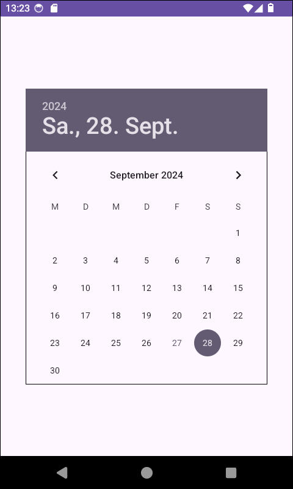

# Android-App: Event Handling for DatePicker #

 

Android app containing one [DatePicker](https://developer.android.com/reference/android/widget/DatePicker) element
in its only layout file.
As practice event handling for this app has to be added.

 

 

----

## License ##

 

See the [LICENSE file](LICENSE.md) for license rights and limitations (BSD 3-Clause License).

 